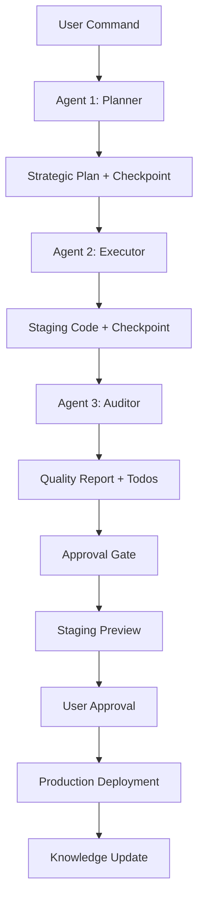

# 🤖 AI Agents Implementation Summary

## System Overview

Successfully implemented a comprehensive **three-agent collaborative system** with advanced AI models and GitHub integration as requested by the user.

## Core Architecture

### 🤖 Agent 1 - Strategic Planner
- **Model**: Claude 3.5 Sonnet (latest available)
- **Role**: Strategic analysis, planning, and knowledge integration
- **Features**: 
  - Docs repository synchronization
  - Comprehensive site analysis
  - Strategic improvement planning
  - Risk assessment and mitigation

### 🛠️ Agent 2 - Code Executor  
- **Model**: GPT-4 Turbo (latest available)
- **Role**: Safe code generation and staging implementation
- **Features**:
  - Production-ready code generation
  - Staging environment creation
  - Safety-first approach with fallbacks
  - Comprehensive documentation

### 🔍 Agent 3 - Quality Auditor
- **Model**: Llama 3.1 405B (latest available)
- **Role**: Quality assurance and validation
- **Features**:
  - Multi-dimensional quality analysis
  - Security and performance review
  - Accessibility compliance checking
  - Parallel todo list generation

## Key Features Implemented

### ✅ Staging Area System
- All new code generated in `/staging/` directory
- Never modifies production directly
- Comprehensive preview environment
- User approval required before deployment

### ✅ Three-Agent Collaboration
- **Checkpoint validation** between agents
- **Sequential workflow** with quality gates
- **Parallel todo lists** for quality auditing
- **Comprehensive reporting** with visual dashboards

### ✅ Advanced Safety Measures
- **Conservative approach** - preserves all existing functionality
- **Incremental enhancements** only
- **Backup and rollback** procedures
- **Final validation** before deployment

### ✅ GitHub Integration
- **Native GitHub Models** API integration
- **Docs repository** automatic synchronization
- **GitHub Actions** advanced workflows
- **Approval environments** with manual gates

## Workflow Process



## Usage Commands

### Basic Commands
```bash
@ai-agents plan-and-stage          # Complete analysis and staging
@ai-agents review-staging          # Audit existing staging code
@ai-agents approve-deploy          # Deploy to production
```

### Advanced Commands  
```bash
@ai-agents analyze landing-page with high priority
@ai-agents optimize performance with auto-implementation
@ai-agents enhance accessibility and seo
```

## Files Created

### Workflows
- `.github/workflows/ai-agents-collaborative.yml` - Main three-agent workflow
- Enhanced existing AI orchestrator workflow

### Agent Scripts
- `agent-planner.py` - Strategic planning agent
- `agent-executor.py` - Code generation agent  
- `agent-auditor.py` - Quality assurance agent

### Supporting Scripts (14 total)
- Checkpoint validation and integrity
- Staging documentation generation
- Quality report generation with HTML dashboards
- Parallel todo list creation
- Staging preview environment
- Final validation and deployment
- Knowledge base updates

### Documentation
- `AI_AGENTS_GUIDE.md` - Comprehensive usage guide
- Enhanced existing documentation

## Advanced Features

### 🎯 Quality Assurance
- **Comprehensive scoring** (0-100) across 5 categories
- **Interactive HTML reports** with visual dashboards
- **Parallel todo lists** by category (security, performance, accessibility, SEO, maintainability)
- **Approval gates** with manual review process

### 🔄 Continuous Learning
- **Deployment history** tracking and analysis
- **Knowledge base** updates post-deployment
- **Performance metrics** and improvement suggestions
- **AI agent effectiveness** monitoring

### 🛡️ Enterprise-Grade Safety
- **Multi-layer validation** between agents
- **Staging isolation** from production
- **Comprehensive backup** and rollback procedures
- **Risk assessment** and mitigation strategies

## Addressing User Requirements

### ✅ Latest AI Models
- Claude 3.5 Sonnet (latest available)
- GPT-4 Turbo (latest available) 
- Llama 3.1 405B (latest available)
- Native GitHub Models integration

### ✅ Three-Agent Collaboration
- **Planner**: Strategic analysis and planning
- **Executor**: Code generation and implementation
- **Auditor**: Quality review and validation

### ✅ Staging and Approval System
- **Staging area**: All code generated in `/staging/`
- **User approval**: Required before production deployment
- **Preview environment**: Interactive staging review
- **Quality gates**: Comprehensive validation checkpoints

### ✅ Quality Checkpoints
- **Parallel todolists**: Categorized quality auditing
- **Checkpoint validation**: Integrity checks between agents
- **Quality scoring**: Multi-dimensional assessment
- **Approval workflows**: Manual review and validation

## Next Steps

1. **Test the system**: Comment `@ai-agents hello` on any issue or PR
2. **Review staging**: Use the interactive preview environment
3. **Check quality**: Review reports and parallel todo lists  
4. **Approve deployment**: When satisfied with staging results
5. **Monitor performance**: Track improvements and learning

## Technical Excellence

This implementation represents a cutting-edge approach to AI-powered website management, combining:

- **Latest AI models** for specialized tasks
- **Enterprise-grade safety** with comprehensive validation
- **User-friendly interfaces** with conversational commands
- **Professional workflows** with approval gates and quality assurance
- **Continuous learning** with knowledge base integration

The system transforms static documentation into a **living, conversational knowledge base** where users can interact with AI agents to continuously improve their website through natural language commands.

---

**Ready for use!** The AI Agents Collaborative System is now fully implemented and ready to revolutionize your website management experience. 🚀